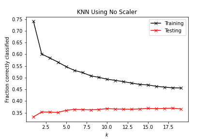

# Liberia Wealth Prediction
As a personal extension of my previously completed extra credit assignment ([located here](https://sasan-faraj.github.io/Extra_Credit)), I aimed to compare a random forest model and a K-nearest neighbors model in their accuracy of predicting the level of wealth of individuals persons in Liberia. My code for this project can be located [here](https://sasan-faraj.github.io/wealth_prediction/Wealth_Predictions).

___

## Initial Analysis

A correlation matrix was not created in the primary analyses of the features or the target because neither the data did not appear to be linearly based in the previous project. In order to double check that the data seemed to be accurately distributed, a pairplot of the features was created. The features in this case were location, gender, size, education, and age. All of the features were represented as a in interger data type.

The pairplot demonstrates that the data is not distributed in any abnormal ways that would require further investigation. 

When examining the target, it appears that the vast majority of individuals, 75%, are ranked below 3 out of 5, indicating that those who make the most money are outliers of the data set. The box plot below depicts the range of wealth from the data set. 

This box plot indicates that the models may have some trouble predicting the wealth because the data set has an over-representation of individuals who make relatively lower income compared to the other individuals. 
___

## K-Nearest Neighbors

Because the KNN model relies on the distance between k points, an instance of the KNN model was created for three seperate standardizations of the features: no standarization (ie raw data), Standard Scaler (SS), and MinMax Scaler (MM). Forty percent of the data was made into the test data and 60 percent was made into the training data. The decision behind this split was to prevent from too high internal validity and limit overfitting. 

Graphs of the different instances were created in order to depict the varying levels of training/testing scores for different numbers of k ranging from 2-20. 2 was chosen because it allows for the basic level of meaningful analysis, and 20 was chosen because little change presented itself as the number continued to grow. 

The ideal number of k was chosen by deciding which number of neighbors reduced overfitting without comprimising the accuracy of training score; the k chosen for comparison was 6. It is clear from the images that the KNN model did not perform well because in all cases the testing accuracy was less than 50%. The testing accuracy was the lowest using the standard scaler and highest using the minmax scaler, .252 and .389 respectively.

Though it is not shown within the code, a single instance of the KNN model was created on the raw data basing the weight off of distance rather than uniform, but that test became extremely overfit and did not accurately asses the data ass did the use with uniform based weighting.

___

## Random Forest Model

An instance of a random forest model using the raw data was created for each max tree depth from a range of 2-20 and for a range of trees from 10, 50, 100, and to 500. A comparison with the standardized data was not necessary because a random forest model is not based on distance. The instance with the highest accuracy was with a depth of 11 and 500 trees; the accuracy was .425.

___

## Reasoning Behind the Results, Limits, and Possible Avenues for Improvments

As was predicted in the initial anlysis, the models did not perform to well. Specifically, the KNN models all were drastically overfit. I believe that the over-representation of lower-income individuals tied with the lack of variety in features caused the lack in performance. For instance, rather than the data simply representing location in terms of intergers from 0-15, it could have been easier to draw relationships between more specific coordinate points. This type of geogrpahical analyses is generally conducted using bayesian based inference techniques, as discussed in my literature review conducted last year ([located here](https://sasan-faraj.github.io/workshop/assignment_3))

___

## Reason for Project
This is my first project out of many that I aim to conduct outside of an academic setting. My main goal of the project was to reflect on some of my road blocks (ie what didn't go so well) from creating my own data science project without overlying instructions. As I desire to  explore my different areas of research interests, I simply modified a past extra credit assignment in order to ease the transition into more realistic analysis. 
