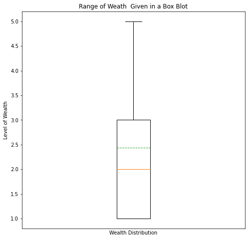
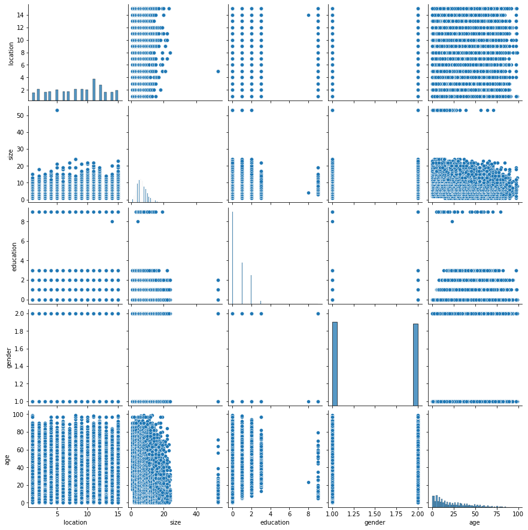
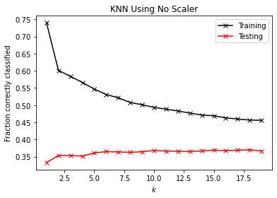
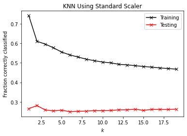
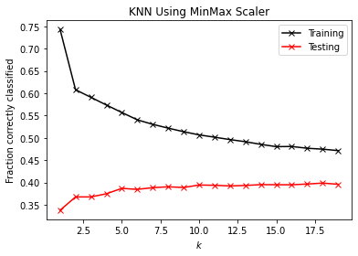

# A Predictive Analysis of the Location of Individuals in Liberia 

### Basic Outline (Written out before analysis)
- Import relevant libraries
- Initial Analyses
    - Load in dataframe
    - Seperate target from features
    - Look at data type of target, range (create a boxplot), and other numerical characteristics
    - Look at features characteristics
    - Create a data frame for train/test for raw data, standard scalar, and minmax scalar (as these are widely used)
    - Create dictionaries for K Nearest Neighbors and random forest. Use 'raw','ss', and 'mm' as keys and a list with training score, testing score, and difference between the two as the value
- K Nearest Neighbors
    - Create an instance of KNN based on the raw, ss, and mm scalars, and add scores to the dictionary
- Random Forest
    - Create an RF model for all scalars
        - for each rf instance, vary the tree depth and and number of trees from 2-20 and 10,50,100,500
    - Add scores to the dictionary

### Initial Analysis


```python
#Import Libraries

#Basic analyses
import pandas as pd
import numpy as np
import matplotlib.pyplot as plt
import seaborn as sns
import statistics
from sklearn.metrics import accuracy_score


#Import KNN and RF
from sklearn.neighbors import KNeighborsClassifier as KNN
from sklearn.ensemble import RandomForestClassifier as RFC

#Scalars and test/train
from sklearn.model_selection import train_test_split as tts
from sklearn.preprocessing import MinMaxScaler as MM
from sklearn.preprocessing import StandardScaler as SS
```


```python
def DoKFold(model,X,y,k,random_state=146,scaler=None): #function built in class
    '''Function will perform K-fold validation and return a list of K training and testing scores, inclduing R^2 as well as MSE.
    
        Inputs:
            model: An sklearn model with defined 'fit' and 'score' methods
            X: An N by p array containing the features of the model.  The N rows are observations, and the p columns are features.
            y: An array of length N containing the target of the model
            k: The number of folds to split the data into for K-fold validation
            random_state: used when splitting the data into the K folds (default=146)
            scaler: An sklearn feature scaler.  If none is passed, no feature scaling will be performed
        Outputs:
            train_scores: A list of length K containing the training scores
            test_scores: A list of length K containing the testing scores
            train_mse: A list of length K containing the MSE on training data
            test_mse: A list of length K containing the MSE on testing data
    '''
    
    from sklearn.model_selection import KFold
    kf = KFold(n_splits=k,shuffle=True,random_state=random_state)
    
    train_scores=[]
    test_scores=[]
    train_mse=[]
    test_mse=[]
    
    for idxTrain, idxTest in kf.split(X):
        Xtrain = X[idxTrain,:]
        Xtest = X[idxTest,:]
        ytrain = y[idxTrain]
        ytest = y[idxTest]
        
        if scaler != None:
            Xtrain = scaler.fit_transform(Xtrain)
            Xtest = scaler.transform(Xtest)
        
        model.fit(Xtrain,ytrain)
        
        train_scores.append(model.score(Xtrain,ytrain))
        test_scores.append(model.score(Xtest,ytest))
        
        # Compute the mean squared errors
        ytrain_pred = model.predict(Xtrain)
        ytest_pred = model.predict(Xtest)
        train_mse.append(np.mean((ytrain-ytrain_pred)**2))
        test_mse.append(np.mean((ytest-ytest_pred)**2))
        
    return train_scores,test_scores,train_mse,test_mse
```


```python
#read in csv
df = pd.read_csv('./data/lbr_persons.csv')
```


```python
df.head()
```


<div>
<style scoped>
    .dataframe tbody tr th:only-of-type {
        vertical-align: middle;
    }

    .dataframe tbody tr th {
        vertical-align: top;
    }

    .dataframe thead th {
        text-align: right;
    }
</style>
<table border="1" class="dataframe">
  <thead>
    <tr style="text-align: right;">
      <th></th>
      <th>Unnamed: 0</th>
      <th>location</th>
      <th>size</th>
      <th>wealth</th>
      <th>gender</th>
      <th>age</th>
      <th>education</th>
    </tr>
  </thead>
  <tbody>
    <tr>
      <th>0</th>
      <td>1</td>
      <td>6</td>
      <td>11</td>
      <td>1</td>
      <td>1</td>
      <td>54</td>
      <td>2</td>
    </tr>
    <tr>
      <th>1</th>
      <td>2</td>
      <td>6</td>
      <td>3</td>
      <td>4</td>
      <td>1</td>
      <td>37</td>
      <td>3</td>
    </tr>
    <tr>
      <th>2</th>
      <td>3</td>
      <td>6</td>
      <td>10</td>
      <td>4</td>
      <td>2</td>
      <td>50</td>
      <td>0</td>
    </tr>
    <tr>
      <th>3</th>
      <td>4</td>
      <td>6</td>
      <td>1</td>
      <td>3</td>
      <td>1</td>
      <td>32</td>
      <td>2</td>
    </tr>
    <tr>
      <th>4</th>
      <td>5</td>
      <td>6</td>
      <td>7</td>
      <td>3</td>
      <td>1</td>
      <td>36</td>
      <td>0</td>
    </tr>
  </tbody>
</table>
</div>


```python
#change index to unnamed and then seperate location from the rest
df = df.set_index('Unnamed: 0')
df.head()
```


<div>
<style scoped>
    .dataframe tbody tr th:only-of-type {
        vertical-align: middle;
    }

    .dataframe tbody tr th {
        vertical-align: top;
    }

    .dataframe thead th {
        text-align: right;
    }
</style>
<table border="1" class="dataframe">
  <thead>
    <tr style="text-align: right;">
      <th></th>
      <th>location</th>
      <th>size</th>
      <th>wealth</th>
      <th>gender</th>
      <th>age</th>
      <th>education</th>
    </tr>
    <tr>
      <th>Unnamed: 0</th>
      <th></th>
      <th></th>
      <th></th>
      <th></th>
      <th></th>
      <th></th>
    </tr>
  </thead>
  <tbody>
    <tr>
      <th>1</th>
      <td>6</td>
      <td>11</td>
      <td>1</td>
      <td>1</td>
      <td>54</td>
      <td>2</td>
    </tr>
    <tr>
      <th>2</th>
      <td>6</td>
      <td>3</td>
      <td>4</td>
      <td>1</td>
      <td>37</td>
      <td>3</td>
    </tr>
    <tr>
      <th>3</th>
      <td>6</td>
      <td>10</td>
      <td>4</td>
      <td>2</td>
      <td>50</td>
      <td>0</td>
    </tr>
    <tr>
      <th>4</th>
      <td>6</td>
      <td>1</td>
      <td>3</td>
      <td>1</td>
      <td>32</td>
      <td>2</td>
    </tr>
    <tr>
      <th>5</th>
      <td>6</td>
      <td>7</td>
      <td>3</td>
      <td>1</td>
      <td>36</td>
      <td>0</td>
    </tr>
  </tbody>
</table>
</div>


```python
X = df.copy().drop('wealth', axis=1)
y = df.copy()['wealth']
```


```python
X.head()
```


<div>
<style scoped>
    .dataframe tbody tr th:only-of-type {
        vertical-align: middle;
    }

    .dataframe tbody tr th {
        vertical-align: top;
    }

    .dataframe thead th {
        text-align: right;
    }
</style>
<table border="1" class="dataframe">
  <thead>
    <tr style="text-align: right;">
      <th></th>
      <th>location</th>
      <th>size</th>
      <th>gender</th>
      <th>age</th>
      <th>education</th>
    </tr>
    <tr>
      <th>Unnamed: 0</th>
      <th></th>
      <th></th>
      <th></th>
      <th></th>
      <th></th>
    </tr>
  </thead>
  <tbody>
    <tr>
      <th>1</th>
      <td>6</td>
      <td>11</td>
      <td>1</td>
      <td>54</td>
      <td>2</td>
    </tr>
    <tr>
      <th>2</th>
      <td>6</td>
      <td>3</td>
      <td>1</td>
      <td>37</td>
      <td>3</td>
    </tr>
    <tr>
      <th>3</th>
      <td>6</td>
      <td>10</td>
      <td>2</td>
      <td>50</td>
      <td>0</td>
    </tr>
    <tr>
      <th>4</th>
      <td>6</td>
      <td>1</td>
      <td>1</td>
      <td>32</td>
      <td>2</td>
    </tr>
    <tr>
      <th>5</th>
      <td>6</td>
      <td>7</td>
      <td>1</td>
      <td>36</td>
      <td>0</td>
    </tr>
  </tbody>
</table>
</div>


```python
print(y.head())
y.unique()
```

    Unnamed: 0
    1    1
    2    4
    3    4
    4    3
    5    3
    Name: wealth, dtype: int64


    array([1, 4, 3, 5, 2])


```python
#See if there are any discrepancies between how the percentiles are reported
quantiles = np.quantile(y.values, [0, 0.25,0.5,0.75, 1])
first_quart = np.percentile(y.values, 25, interpolation = 'midpoint')
third_quart = np.percentile(y.values, 75, interpolation = 'midpoint')

plt.figure(figsize=(8,8))
plt.boxplot(y.values, meanline=True, showmeans=True)
plt.xticks([])
plt.ylabel('Level of Wealth')
plt.xlabel('Wealth Distribution')
plt.title('Range of Weath  Given in a Box Blot')
plt.savefig('lbr_wealth_range.png')
plt.show()
print('The median wealth is ' + format(statistics.median_grouped(y.values), '.3f'))
print('The inner quartile range of the wealth answers is from a rating of ' + str(first_quart)\
      + ' to ' + str(third_quart))
print('The maximum wealth was ' + str(max(y.values)))
print('The minimum wealth was ' + str(min(y.values)))
```


    

    


    The median wealth is 2.228
    The inner quartile range of the wealth answers is from a rating of 1.0 to 3.0
    The maximum wealth was 5
    The minimum wealth was 1


```python
#note that means 75% of people were 3 or under
print(y.value_counts())
```

    1    14837
    2    12743
    3    10106
    4     6028
    5     4505
    Name: wealth, dtype: int64


```python
#pairplot, no need for corr matrix because we are not using linear models
```


```python
sns.pairplot(X[['location', 'size', 'education', 'gender', 'age']])
plt.savefig('lbr_pair_plot.png')
plt.show()
```


    

    


```python
#split the data into train/testing splits for raw, mm, ss
```


```python
Xtrain, Xtest, ytrain, ytest = tts(X,y, test_size=.4, random_state=146)

mm = MM()
Xtrain_mm = mm.fit_transform(Xtrain)
Xtest_mm = mm.transform(Xtest)

ss = SS()
Xtrain_ss = ss.fit_transform(Xtrain)
Xtest_ss = mm.transform(Xtest)

```


```python
#Make dictionaries
knn_scores = dict()
raw_scores = dict()
rf_scores = dict()
```

## KNN


```python
#perfom a K-NN model on raw data, find best k from a range of 0-15
k_range = range(1,20)
ktest_raw_scores = dict()
ktrain_raw_scores = dict()
for k in k_range:
    knn = KNN(n_neighbors = k) 
    knn.fit(Xtrain,ytrain)
    acc_train = knn.score(Xtrain,ytrain)
    ktrain_raw_scores[k]=acc_train
    y_pred = knn.predict(Xtest)
    acc = accuracy_score(ytest,y_pred)
    ktest_raw_scores[k] = acc


```


```python
lis_train = []
for val in ktrain_raw_scores.values():
    lis_train.append(val)
lis_test=[]
for val in ktest_raw_scores.values():
    lis_test.append(val)
```


```python
#graph comparison
k_range = np.arange(1, 20, 1)
plt.plot(k_range, lis_train,'-xk', label='Training')
plt.plot(k_range,lis_test,'-xr', label='Testing')
plt.title('KNN Using No Scaler')
plt.xlabel('$k$')
plt.ylabel('Fraction correctly classified')
plt.legend()
plt.savefig('knn_raw.png')
plt.show()

```


    

    


```python
validity_k_raw = lis_train[6]-lis_test[6]
knn_scores['raw'] = [lis_train[6], lis_test[6], validity_k_raw]
knn_scores
```


    {'raw': [0.5215858421762124, 0.36374948154292824, 0.15783636063328416]}


```python
ktrain_ss_scores =[]
ktest_ss_scores = []
for k in k_range:
    knn = KNN(n_neighbors = k) 
    knn.fit(Xtrain_ss,ytrain)
    acc_train = knn.score(Xtrain_ss,ytrain)
    ktrain_ss_scores.append(acc_train)
    y_pred = knn.predict(Xtest_ss)
    acc = accuracy_score(ytest,y_pred)
    ktest_ss_scores.append(acc)

#plot scores    
plt.plot(k_range, ktrain_ss_scores,'-xk', label='Training')
plt.plot(k_range,ktest_ss_scores,'-xr', label='Testing')
plt.title('KNN Using Standard Scaler')
plt.xlabel('$k$')
plt.ylabel('Fraction correctly classified')
plt.legend()
plt.savefig('knn_ss.png')
plt.show()
```


    

    


```python
validity_k_ss = ktrain_ss_scores[6]-ktest_ss_scores[6]
knn_scores['ss'] = [ktrain_ss_scores[6], ktest_ss_scores[6], validity_k_ss]
knn_scores
```


    {'raw': [0.5215858421762124, 0.36374948154292824, 0.15783636063328416],
     'ss': [0.5296740520548893, 0.2516072169224388, 0.27806683513245045]}


```python
ktrain_mm_scores =[]
ktest_mm_scores = []
for k in k_range:
    knn = KNN(n_neighbors = k) 
    knn.fit(Xtrain_mm,ytrain)
    acc_train = knn.score(Xtrain_mm,ytrain)
    ktrain_mm_scores.append(acc_train)
    y_pred = knn.predict(Xtest_mm)
    acc = accuracy_score(ytest,y_pred)
    ktest_mm_scores.append(acc)

#plot scores    
plt.plot(k_range, ktrain_mm_scores,'-xk', label='Training')
plt.plot(k_range,ktest_mm_scores,'-xr', label='Testing')
plt.title('KNN Using MinMax Scaler')
plt.xlabel('$k$')
plt.ylabel('Fraction correctly classified')
plt.legend()
plt.savefig('knn_mm.png')
plt.show()
```


    

    


```python
validity_k_mm = ktrain_mm_scores[6]-ktest_mm_scores[6]
knn_scores['mm'] = [ktrain_mm_scores[6], ktest_mm_scores[6], validity_k_mm]
knn_scores
```


    {'raw': [0.5215858421762124, 0.36374948154292824, 0.15783636063328416],
     'ss': [0.5296740520548893, 0.2516072169224388, 0.27806683513245045],
     'mm': [0.5303999170440012, 0.38853172957279136, 0.14186818747120988]}


## Random Forest


```python
rf_raw_scores = []
d_range = np.arange(2,20, 1)
t_range = [10,50,100,500]
for d in d_range:
    for t in t_range:
        params = [d,t]
        rfc = RFC(random_state=146, max_depth=d,n_estimators = t)
        rfc.fit(Xtrain,ytrain)
        score = rfc.score(Xtest,ytest)
        rf_raw_scores.append([*params,score])

```


    [[2, 10, 0.33461219411032767],
     [2, 50, 0.3262650352550809],
     [2, 100, 0.33596018249688925],
     [2, 500, 0.34072998755703027],
     [3, 10, 0.3511509746992949],
     [3, 50, 0.35830568228950643],
     [3, 100, 0.3636976358357528],
     [3, 500, 0.3642160929075073],
     [4, 10, 0.3727187888842804],
     [4, 50, 0.37121526337619243],
     [4, 100, 0.3728224802986313],
     [4, 500, 0.37385939444214017],
     [5, 10, 0.37779966818747407],
     [5, 50, 0.38080671920364995],
     [5, 100, 0.38080671920364995],
     [5, 500, 0.38453961012028204],
     [6, 10, 0.3897760265450021],
     [6, 50, 0.398019493985898],
     [6, 100, 0.39931563666528413],
     [6, 500, 0.4043965159684778],
     [7, 10, 0.39625673994193283],
     [7, 50, 0.4090626296142679],
     [7, 100, 0.41108461219411035],
     [7, 500, 0.41414350891746166],
     [8, 10, 0.4081812525922854],
     [8, 50, 0.4102550808793032],
     [8, 100, 0.4139879717959353],
     [8, 500, 0.4165802571547076],
     [9, 10, 0.41315844048112815],
     [9, 50, 0.41782455412691827],
     [9, 100, 0.41937992534218166],
     [9, 500, 0.42321650767316465],
     [10, 10, 0.41699502281211115],
     [10, 50, 0.42176482787225217],
     [10, 100, 0.420468685192866],
     [10, 500, 0.4244089589381999],
     [11, 10, 0.41486934881791787],
     [11, 50, 0.42093529655744505],
     [11, 100, 0.4235275819162173],
     [11, 500, 0.4249792617171298],
     [12, 10, 0.40999585234342595],
     [12, 50, 0.41575072583990047],
     [12, 100, 0.420002073828287],
     [12, 500, 0.4206242223143924],
     [13, 10, 0.40320406470344256],
     [13, 50, 0.4106180008295313],
     [13, 100, 0.41321028618830363],
     [13, 500, 0.4153359601824969],
     [14, 10, 0.3949605972625467],
     [14, 50, 0.40387805889672335],
     [14, 100, 0.40755910410618],
     [14, 500, 0.4071961841559519],
     [15, 10, 0.3866134384072999],
     [15, 50, 0.39718996267109086],
     [15, 100, 0.3973973454997926],
     [15, 500, 0.4004043965159685],
     [16, 10, 0.38148071339693074],
     [16, 50, 0.3895686437163003],
     [16, 100, 0.3912277063459146],
     [16, 500, 0.39159062629614266],
     [17, 10, 0.37458523434259644],
     [17, 50, 0.38127333056822893],
     [17, 100, 0.3828287017834923],
     [17, 500, 0.38671712982165074],
     [18, 10, 0.37308170883450853],
     [18, 50, 0.3757258399004562],
     [18, 100, 0.377903359601825],
     [18, 500, 0.3805474906677727],
     [19, 10, 0.3679489838241394],
     [19, 50, 0.3713708004977188],
     [19, 100, 0.3734964744919121],
     [19, 500, 0.3781625881377022]]


```python
mx = 0
params = []
for i in range(len(rf_raw_scores)):
    if rf_raw_scores[i][2] > mx:
        params = [rf_raw_scores[i][0],rf_raw_scores[i][1]]
        mx = rf_raw_scores[i][2]
    
```


```python
print(mx)
print(params)
```

    0.4249792617171298
    [11, 500]


```python

```


    72


## Kfold Validation


```python
rfc = RFC(random_state=146, max_depth=11,n_estimators=500)
rf_train,rf_test,_,_ = DoKFold(rfc,X.values,y.values,20)
print(np.mean(rf_train))
print(np.mean(rf_test))
```

    0.5136586251268355
    0.43306571195987964


```python
knn = KNN(n_neighbors=6)
mms = MMS()
train_scores_mms_knn,test_scores_mms_knn,_,_ = DoKFold(knn,X.values,y.values,20,scaler=mms) 
print('Avg train score on knn_mm: ' + str(np.mean(train_scores_mms_knn)))
print('Avg test score on knn_mm: ' + str(np.mean(test_scores_mms_knn)))
#the average k-fold testing checks out
```

    Avg train score on knn_mm: 0.5382580130320153
    Avg test score on knn_mm: 0.38779286155604237


```python

```
